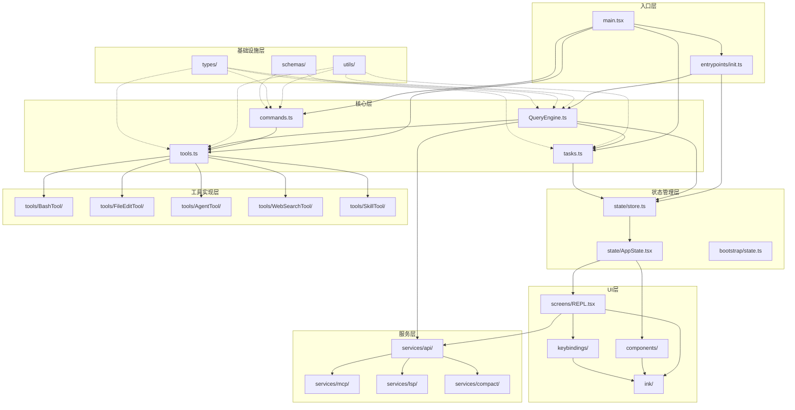
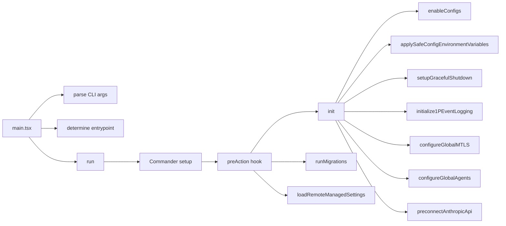
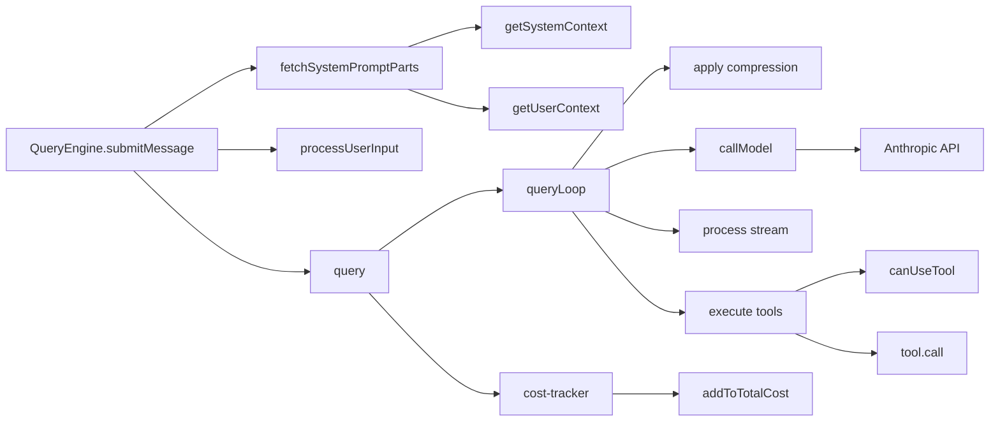
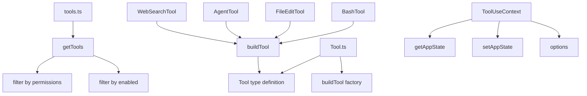
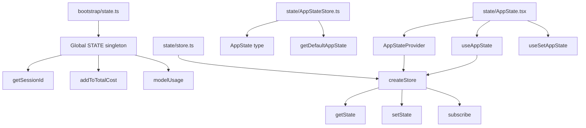
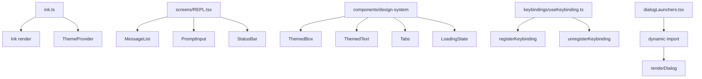
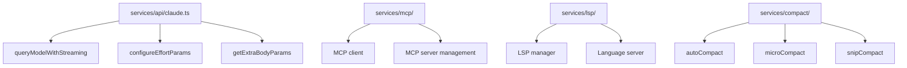
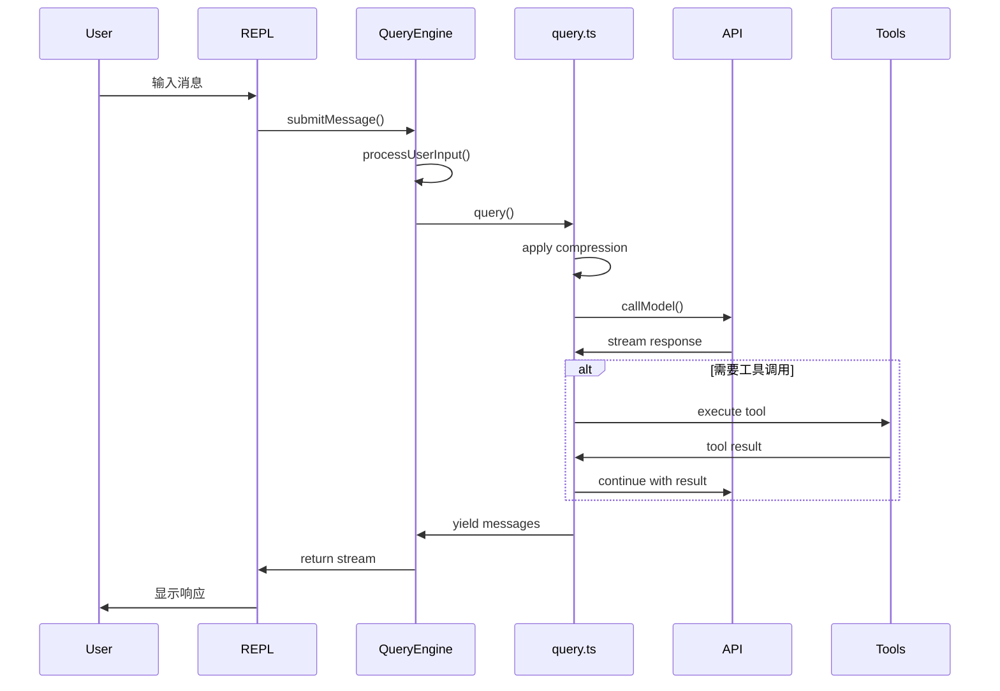
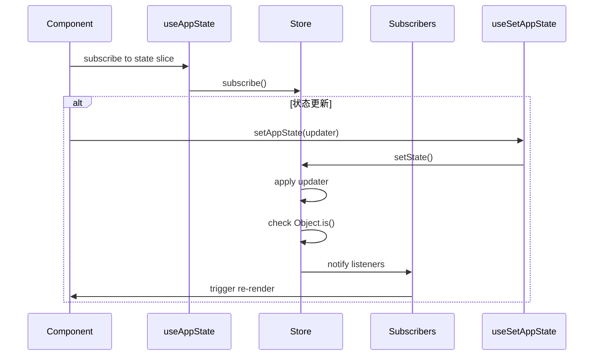
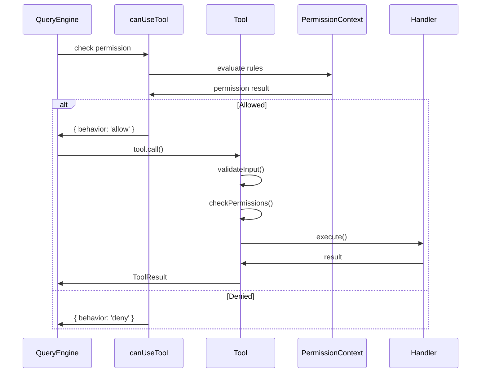

# Claude Code 模块依赖关系图

> 分析日期: 2026-03-31  

---

## 1. 整体架构图



---

## 2. 详细模块依赖图

### 2.1 入口与启动流程



### 2.2 QueryEngine数据流



### 2.3 工具系统架构



### 2.4 状态管理架构



### 2.5 UI组件架构



### 2.6 服务层架构



---

## 3. 数据流图

### 3.1 用户输入到响应的完整流程



### 3.2 状态更新流程



### 3.3 工具调用流程



---

## 4. 模块职责矩阵

| 模块 | 主要职责 | 依赖模块 | 被依赖模块 |
|-----|---------|---------|-----------|
| main.tsx | CLI入口、参数解析、启动流程 | init.ts, commands.ts, tools.ts | - |
| init.ts | 初始化配置、遥测、网络设置 | bootstrap/state.ts | main.tsx |
| QueryEngine.ts | 对话生命周期、流式处理 | query.ts, cost-tracker.ts | main.tsx, SDK |
| query.ts | 查询循环、压缩策略 | QueryEngine.ts, services/api/ | QueryEngine.ts |
| commands.ts | 命令注册、懒加载 | tools.ts, skills/ | main.tsx |
| tools.ts | 工具注册、权限过滤 | Tool.ts, tools/*/ | commands.ts, QueryEngine.ts |
| Tool.ts | 工具类型定义、buildTool工厂 | types/ | tools.ts, tools/*/ |
| tasks.ts | 任务注册、类型分发 | Task.ts, tasks/*/ | QueryEngine.ts |
| state/store.ts | 通用Store实现 | - | AppState.tsx |
| AppState.tsx | React状态集成 | store.ts | screens/, components/ |
| bootstrap/state.ts | 全局单例状态 | - | init.ts, services/ |
| ink.ts | Ink入口、主题封装 | ink/, components/design-system/ | screens/ |
| screens/REPL.tsx | 主屏幕 | components/, keybindings/, ink.ts | main.tsx |
| services/api/ | API客户端 | bootstrap/state.ts | query.ts |
| services/mcp/ | MCP协议实现 | - | tools/MCPTool |
| utils/ | 工具函数 | types/ | 所有模块 |
| types/ | 类型定义 | - | 所有模块 |

---

## 5. 关键依赖路径

### 5.1 启动依赖路径

```
main.tsx
├── entrypoints/init.ts
│   ├── bootstrap/state.ts
│   ├── utils/config.ts
│   ├── utils/managedEnv.ts
│   └── services/analytics/
├── commands.ts
│   ├── commands/*/
│   └── skills/
├── tools.ts
│   ├── Tool.ts
│   └── tools/*/
└── state/AppState.tsx
    ├── state/store.ts
    └── state/AppStateStore.ts
```

### 5.2 查询依赖路径

```
QueryEngine.submitMessage()
├── context.ts
│   ├── utils/git.ts
│   └── utils/claudemd.ts
├── query.ts
│   ├── query/deps.ts
│   ├── query/config.ts
│   └── services/compact/
├── tools.ts
│   └── tools/*/
└── cost-tracker.ts
    └── bootstrap/state.ts
```

### 5.3 UI渲染依赖路径

```
screens/REPL.tsx
├── components/MessageList.tsx
│   ├── components/Message.tsx
│   └── components/ToolUseMessage.tsx
├── components/PromptInput.tsx
│   └── keybindings/useKeybinding.ts
├── ink.ts
│   ├── ink/ink.tsx
│   └── components/design-system/
└── state/AppState.tsx
    └── state/store.ts
```

---

## 6. 循环依赖分析

### 6.1 已识别的循环依赖

1. **commands.ts ↔ tools.ts**
   - commands.ts导入tools.ts获取工具列表
   - 某些工具可能调用命令（通过ToolUseContext）
   - 解决：通过接口解耦，ToolUseContext提供commands而不直接导入

2. **QueryEngine.ts ↔ query.ts**
   - QueryEngine调用query函数
   - query.ts中的错误处理可能需要QueryEngine的方法
   - 解决：通过QueryDeps依赖注入

3. **bootstrap/state.ts ↔ services/**
   - state.ts提供服务状态存储
   - 服务需要读取/更新状态
   - 解决：state.ts只提供基础getters/setters，业务逻辑在服务中

### 6.2 避免循环依赖的策略

```typescript
// 1. 依赖注入
export type QueryDeps = {
  callModel: (params: CallModelParams) => AsyncGenerator<StreamEvent>
  // 不直接导入实现
}

// 2. 接口隔离
export interface ToolUseContext {
  options: {
    commands: Command[]  // 通过配置传入，而非导入
    tools: Tools
  }
}

// 3. 事件驱动
export const onSessionSwitch = sessionSwitched.subscribe
// 通过事件而非直接调用
```

---

## 7. 扩展点分析

### 7.1 命令扩展点

```typescript
// commands.ts
const COMMANDS = memoize((): Command[] => [
  ...builtInCommands,
  ...bundledSkills,      // <-- 扩展点1: 捆绑技能
  ...pluginCommands,     // <-- 扩展点2: 插件命令
  ...skillDirCommands,   // <-- 扩展点3: 技能目录
  ...workflowCommands,   // <-- 扩展点4: 工作流
])
```

### 7.2 工具扩展点

```typescript
// tools.ts
export function getAllBaseTools(): Tools {
  return [
    BashTool,
    FileReadTool,
    FileEditTool,
    // ...
    ...(feature('AGENT_TRIGGERS') ? cronTools : []),  // <-- 条件扩展
    ...(feature('WEB_BROWSER_TOOL') ? [WebBrowserTool] : []),
    // 更多条件工具...
  ]
}
```

### 7.3 状态扩展点

```typescript
// state/AppStateStore.ts
export type AppState = DeepImmutable<{
  // 核心状态
  settings: SettingsJson
  verbose: boolean
  // ...
} & {
  // 扩展状态（非DeepImmutable）
  tasks: { [taskId: string]: TaskState }
  mcp: { clients: MCPServerConnection[]; tools: Tool[] }
  plugins: { enabled: LoadedPlugin[]; disabled: LoadedPlugin[] }
  // ...
}>
```

### 7.4 插件扩展点

```typescript
// plugins/builtinPlugins.ts
export interface PluginManifest {
  name: string
  skills?: string[]           // <-- 扩展点: Skills
  mcpServers?: string[]       // <-- 扩展点: MCP服务器
  commands?: Command[]        // <-- 扩展点: 命令
  hooks?: Hook[]              // <-- 扩展点: 生命周期钩子
}
```

---

## 8. 性能关键路径

### 8.1 启动性能路径

```
main.tsx
├── startMdmRawRead()           // 并行
├── startKeychainPrefetch()     // 并行
├── init()                      // 串行
│   ├── enableConfigs()         // ~10ms
│   ├── applySafeConfigEnvironmentVariables()  // ~5ms
│   ├── setupGracefulShutdown() // ~1ms
│   └── ...
└── run()                       // 主逻辑
```

### 8.2 查询性能路径

```
QueryEngine.submitMessage()
├── fetchSystemPromptParts()    // ~50ms (缓存后~1ms)
│   ├── getSystemContext()      // memoized
│   └── getUserContext()        // memoized
├── processUserInput()          // ~10ms
├── query()                     // 主要耗时
│   ├── apply compression       // ~100-500ms
│   ├── callModel()             // ~1000-5000ms
│   └── process tools           // 取决于工具
└── update cost                 // ~1ms
```

### 8.3 渲染性能路径

```
REPL.tsx
├── MessageList                 // 虚拟化渲染
│   ├── Message * N             // N = 可见消息数
│   └── ToolUseMessage * M      // M = 可见工具调用
├── PromptInput                 // 受控组件
└── StatusBar                   // 轻量组件
```

---

## 9. 总结

### 9.1 架构特点

1. **分层清晰**: 入口层、核心层、状态层、UI层、服务层、基础设施层
2. **依赖有序**: 上层依赖下层，避免循环依赖
3. **扩展丰富**: 命令、工具、状态、插件多处可扩展
4. **性能优化**: 并行启动、缓存、懒加载

### 9.2 关键依赖关系

- **纵向**: main → init → services → utils/types
- **横向**: QueryEngine ↔ query ↔ services/api
- **UI**: screens → components → ink → terminal
- **状态**: bootstrap/state ← services ← components

### 9.3 最佳实践

- 使用依赖注入解耦模块
- 通过feature标志控制功能加载
- 利用memoize缓存昂贵计算
- 采用事件驱动处理跨模块通信

---

*文档完成*
