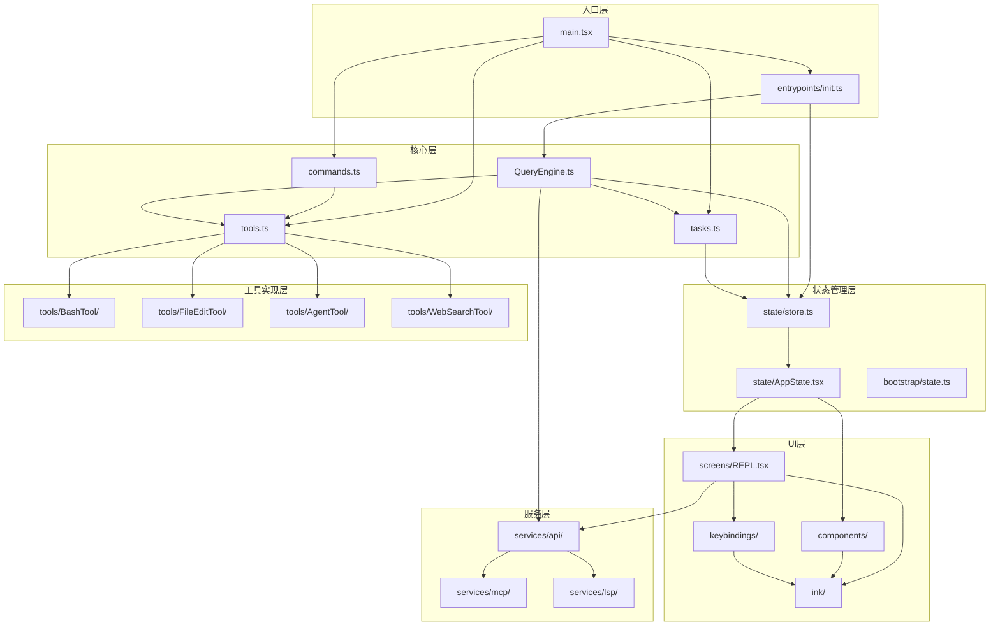

# Claude Code 技术架构深度分析报告

> 分析日期: 2026-03-31  
> 代码规模: ~51.2万行, ~1,900个文件

---

## 目录

1. [项目概览](#1-项目概览)
2. [架构设计哲学](#2-架构设计哲学)
3. [核心架构模块详解](#3-核心架构模块详解)
4. [设计模式与架构亮点](#4-设计模式与架构亮点)
5. [UI/交互架构分析](#5-ui交互架构分析)
6. [可学习的架构实践](#6-可学习的架构实践)
7. [模块依赖关系图](#7-模块依赖关系图)
8. [关键代码走读](#8-关键代码走读)
9. [总结](#9-总结)

---

## 1. 项目概览

### 1.1 项目背景

**Claude Code** 是Anthropic开发的AI代码助手CLI工具，于2026年3月31日通过npm registry的source map文件泄露了完整源代码。

### 1.2 核心技术栈

| 层级 | 技术 |
|------|------|
| **运行时** | Bun (JavaScript/TypeScript运行时) |
| **语言** | TypeScript (严格模式) |
| **终端UI** | React + Ink (React for CLI) |
| **CLI解析** | Commander.js |
| **Schema验证** | Zod v4 |
| **API** | Anthropic SDK |
| **代码搜索** | ripgrep (集成) |
| **协议** | MCP (Model Context Protocol), LSP |

### 1.3 目录结构

```
src/
├── main.tsx                 # 入口点 (Commander.js-based CLI parser)
├── commands.ts              # 命令注册中心
├── tools.ts                 # 工具注册中心
├── Tool.ts                  # 工具类型定义
├── QueryEngine.ts           # LLM查询引擎核心
├── context.ts               # 系统/用户上下文收集
├── cost-tracker.ts          # Token成本追踪
│
├── commands/                # Slash命令实现 (~50)
├── tools/                   # Agent工具实现 (~40)
├── components/              # Ink UI组件 (~140)
├── hooks/                   # React hooks
├── services/                # 外部服务集成
├── screens/                 # 全屏UI (Doctor, REPL, Resume)
├── types/                   # TypeScript类型定义
├── utils/                   # 工具函数
│
├── bridge/                  # IDE集成桥接
├── coordinator/             # 多Agent协调器
├── plugins/                 # 插件系统
├── skills/                  # Skill系统
├── keybindings/             # 键盘绑定配置
├── vim/                     # Vim模式
├── voice/                   # 语音输入
├── remote/                  # 远程会话
├── server/                  # 服务端模式
├── memdir/                  # 内存目录
├── tasks/                   # 任务管理
├── state/                   # 状态管理
├── migrations/              # 配置迁移
├── schemas/                 # 配置schemas (Zod)
├── entrypoints/             # 初始化逻辑
├── ink/                     # Ink渲染器包装
└── ...
```

---

## 2. 架构设计哲学

### 2.1 模块化与关注点分离

```
src/
├── main.tsx              # 入口点: CLI解析 + 启动流程
├── commands.ts           # 命令注册中心
├── tools.ts              # 工具注册中心
├── tasks.ts              # 任务类型注册
├── QueryEngine.ts        # LLM查询引擎核心
├── context.ts            # 上下文收集 (Git状态等)
├── Tool.ts               # 工具类型定义基类
├── Task.ts               # 任务类型定义基类
```

### 2.2 功能标志驱动的代码消除

使用Bun的 `bun:bundle` 特性实现编译时死代码消除：

```typescript
// src/tools.ts
import { feature } from 'bun:bundle'

const SleepTool = feature('PROACTIVE') || feature('KAIROS')
  ? require('./tools/SleepTool/SleepTool.js').SleepTool
  : null

const cronTools = feature('AGENT_TRIGGERS')
  ? [CronCreateTool, CronDeleteTool, CronListTool]
  : []
```

**亮点**: 未启用的功能在构建时完全剔除，减小产物体积。

### 2.3 核心设计原则

1. **延迟加载** - 重型模块按需加载
2. **并行执行** - 启动时并行执行I/O操作
3. **类型安全** - 严格的TypeScript，复杂类型体操
4. **可扩展性** - 插件、Skill、MCP多层扩展机制
5. **可靠性** - 错误恢复、优雅降级、权限控制

---

## 3. 核心架构模块详解

### 3.1 工具系统 (Tool System)

**文件**: `src/Tool.ts`, `src/tools.ts`, `src/tools/*/`

#### 3.1.1 工具接口定义

```typescript
// Tool.ts - 工具接口定义
export type Tool<Input extends AnyObject, Output, P extends ToolProgressData> = {
  name: string
  aliases?: string[]
  description(input: z.infer<Input>, options: {...}): Promise<string>
  call(args: z.infer<Input>, context: ToolUseContext, ...): Promise<ToolResult<Output>>
  inputSchema: Input
  isEnabled(): boolean
  isReadOnly(input: z.infer<Input>): boolean
  isDestructive?(input: z.infer<Input>): boolean
  checkPermissions(input: z.infer<Input>, context: ToolUseContext): Promise<PermissionResult>
  // ... 渲染相关方法
  renderToolUseMessage(input: Partial<z.infer<Input>>, options: {...}): React.ReactNode
  renderToolResultMessage?(content: Output, ...): React.ReactNode
}
```

#### 3.1.2 核心工具列表

| 工具 | 功能 |
|------|------|
| `BashTool` | Shell命令执行 |
| `FileReadTool` | 文件读取(支持图片、PDF) |
| `FileEditTool` | 文件部分编辑 |
| `FileWriteTool` | 文件创建/覆盖 |
| `GlobTool` | 文件模式匹配 |
| `GrepTool` | ripgrep内容搜索 |
| `AgentTool` | 子Agent生成 |
| `SkillTool` | Skill执行 |
| `MCPTool` | MCP服务器工具调用 |
| `LSPTool` | LSP集成 |
| `WebFetchTool` / `WebSearchTool` | Web内容获取/搜索 |

#### 3.1.3 设计亮点

**buildTool工厂函数**: 提供默认值，减少重复代码

```typescript
const TOOL_DEFAULTS = {
  isEnabled: () => true,
  isConcurrencySafe: () => false,
  isReadOnly: () => false,
  checkPermissions: async () => ({ behavior: 'allow', updatedInput: input }),
  toAutoClassifierInput: () => '',
  userFacingName: () => '',
}

export function buildTool<D extends AnyToolDef>(def: D): BuiltTool<D> {
  return { ...TOOL_DEFAULTS, userFacingName: () => def.name, ...def } as BuiltTool<D>
}
```

**使用示例**:

```typescript
export const BashTool = buildTool({
  name: 'bash',
  description: async () => 'Execute a bash command',
  inputSchema: BashToolInputSchema,
  async call(args, context, canUseTool) {
    // 实现
  },
  // 只需覆盖需要自定义的方法
})
```

### 3.2 命令系统 (Command System)

**文件**: `src/commands.ts`, `src/commands/*/`

#### 3.2.1 命令类型定义

```typescript
export type Command = 
  | { type: 'prompt'; name: string; description: string; getPromptForCommand(...): Promise<string> }
  | { type: 'local'; name: string; description: string; execute(args: string[]): Promise<string> }
  | { type: 'local-jsx'; name: string; description: string; render(args: string[]): React.ReactNode }
```

#### 3.2.2 命令加载优先级

```typescript
const COMMANDS = memoize((): Command[] => [
  ...builtInCommands,
  ...bundledSkills,
  ...pluginCommands,
  ...skillDirCommands,
  ...workflowCommands,
])
```

1. Bundled Skills (内置技能)
2. Built-in Plugin Skills
3. 技能目录命令
4. 工作流命令
5. 插件命令
6. 内置命令

#### 3.2.3 懒加载实现

```typescript
// 使用feature标志和动态导入实现懒加载
const assistantCommand = feature('KAIROS')
  ? require('./commands/assistant/index.js').default
  : null

const voiceCommand = feature('VOICE_MODE')
  ? require('./commands/voice/index.js').default
  : null
```

### 3.3 查询引擎 (Query Engine)

**文件**: `src/QueryEngine.ts`, `src/query.ts`

#### 3.3.1 QueryEngine类

```typescript
export class QueryEngine {
  private config: QueryEngineConfig
  private mutableMessages: Message[]
  private abortController: AbortController
  
  async *submitMessage(
    prompt: string | ContentBlockParam[],
    options?: { uuid?: string; isMeta?: boolean }
  ): AsyncGenerator<SDKMessage, void, unknown> {
    // 1. 处理系统提示词
    // 2. 处理用户输入 (slash命令展开)
    // 3. 调用query()进行LLM交互
    // 4. 处理工具调用循环
    // 5. 返回结果
  }
}
```

#### 3.3.2 查询循环

```typescript
async function* queryLoop(params: QueryParams) {
  while (true) {
    // 1. 自动压缩上下文 (auto-compact)
    // 2. 调用模型API
    // 3. 处理流式响应
    // 4. 执行工具调用
    // 5. 检查终止条件
  }
}
```

#### 3.3.3 上下文压缩策略

```typescript
// query.ts 中的压缩流程
async function* queryLoop(params) {
  // 1. Snip压缩 (移除历史消息)
  const snipResult = snipModule!.snipCompactIfNeeded(messagesForQuery)
  
  // 2. 微压缩 (microcompact) - 缓存感知
  const microcompactResult = await deps.microcompact(messagesForQuery, ...)
  
  // 3. 上下文折叠 (context collapse)
  const collapseResult = await contextCollapse.applyCollapsesIfNeeded(messagesForQuery, ...)
  
  // 4. 自动压缩 (autocompact) - 生成摘要
  const { compactionResult } = await deps.autocompact(messagesForQuery, ...)
}
```

### 3.4 状态管理架构

**文件**: `src/state/store.ts`, `src/state/AppStateStore.ts`, `src/state/AppState.tsx`

#### 3.4.1 自定义轻量级Store

```typescript
// store.ts - 极简实现 (仅34行)
export type Store<T> = {
  getState: () => T
  setState: (updater: (prev: T) => T) => void
  subscribe: (listener: () => void) => () => void
}

export function createStore<T>(initialState: T, onChange?: OnChange<T>): Store<T> {
  let state = initialState
  const listeners = new Set<Listener>()
  
  return {
    getState: () => state,
    setState: (updater) => {
      const prev = state
      const next = updater(prev)
      if (Object.is(next, prev)) return  // 引用相等检查
      state = next
      onChange?.({ newState: next, oldState: prev })
      listeners.forEach(l => l())
    },
    subscribe: (listener) => { /* ... */ }
  }
}
```

#### 3.4.2 AppState结构

```typescript
export type AppState = DeepImmutable<{
  settings: SettingsJson
  verbose: boolean
  mainLoopModel: ModelSetting
  toolPermissionContext: ToolPermissionContext
  tasks: { [taskId: string]: TaskState }
  mcp: { clients: MCPServerConnection[]; tools: Tool[]; commands: Command[] }
  plugins: { enabled: LoadedPlugin[]; disabled: LoadedPlugin[]; errors: PluginError[] }
  agentDefinitions: AgentDefinitionsResult
  fileHistory: FileHistoryState
  todos: { [agentId: string]: TodoList }
  notifications: { current: Notification | null; queue: Notification[] }
  // ... 更多状态
}>
```

#### 3.4.3 React集成

```typescript
// AppState.tsx
export function useAppState<T>(selector: (state: AppState) => T): T {
  const store = useAppStore()
  const getState = useCallback(() => selector(store.getState()), [selector, store])
  return useSyncExternalStore(store.subscribe, getState, getState)
}

export function useSetAppState() {
  return useAppStore().setState
}
```

### 3.5 启动流程 (Bootstrap)

**文件**: `src/main.tsx`, `src/entrypoints/init.ts`, `src/bootstrap/state.ts`

#### 3.5.1 main.tsx启动阶段

```typescript
async function main() {
  // 1. 安全检查 (Windows PATH注入防护)
  process.env.NoDefaultCurrentDirectoryInExePath = '1'
  
  // 2. 预取并行启动 (在重模块加载前)
  startMdmRawRead()        // MDM设置
  startKeychainPrefetch()  // macOS钥匙串
  
  // 3. 解析CLI参数
  // 4. 初始化入口点类型
  // 5. 运行主逻辑
  await run()
}
```

#### 3.5.2 init.ts初始化流程

```typescript
export const init = memoize(async (): Promise<void> => {
  // 1. 启用配置系统
  enableConfigs()
  
  // 2. 应用安全环境变量
  applySafeConfigEnvironmentVariables()
  
  // 3. 设置优雅关闭
  setupGracefulShutdown()
  
  // 4. 初始化遥测 (延迟加载)
  void initialize1PEventLogging()
  
  // 5. 配置网络 (mTLS, 代理)
  configureGlobalMTLS()
  configureGlobalAgents()
  
  // 6. 预连接API
  preconnectAnthropicApi()
})
```

---

## 4. 设计模式与架构亮点

### 4.1 工具抽象模式

**buildTool工厂模式**:

```typescript
const TOOL_DEFAULTS = {
  isEnabled: () => true,
  isConcurrencySafe: () => false,
  isReadOnly: () => false,
  checkPermissions: async () => ({ behavior: 'allow', updatedInput: input }),
  // ...
}

export function buildTool<D extends AnyToolDef>(def: D): BuiltTool<D> {
  return { ...TOOL_DEFAULTS, userFacingName: () => def.name, ...def } as BuiltTool<D>
}
```

### 4.2 权限系统架构

**分层权限检查**:

1. **工具级**: `tool.checkPermissions()`
2. **上下文级**: `ToolPermissionContext` (allow/deny/ask规则)
3. **模式级**: `PermissionMode` (default/plan/bypassPermissions/auto)

```typescript
export type ToolPermissionContext = DeepImmutable<{
  mode: PermissionMode
  additionalWorkingDirectories: Map<string, AdditionalWorkingDirectory>
  alwaysAllowRules: ToolPermissionRulesBySource
  alwaysDenyRules: ToolPermissionRulesBySource
  alwaysAskRules: ToolPermissionRulesBySource
  isBypassPermissionsModeAvailable: boolean
  isAutoModeAvailable?: boolean
}>
```

### 4.3 消息类型系统

**discriminated union 设计**:

```typescript
export type Message =
  | UserMessage
  | AssistantMessage
  | SystemMessage
  | ProgressMessage
  | AttachmentMessage
  | ToolUseSummaryMessage
  | TombstoneMessage

export type UserMessage = {
  type: 'user'
  message: { role: 'user'; content: string | ContentBlockParam[] }
  uuid: string
  timestamp: number
  // ...
}
```

### 4.4 类型安全实践

**DeepImmutable类型**:

```typescript
export type DeepImmutable<T> = T extends (infer R)[]
  ? ReadonlyArray<DeepImmutable<R>>
  : T extends Map<infer K, infer V>
  ? ReadonlyMap<DeepImmutable<K>, DeepImmutable<V>>
  : T extends Set<infer S>
  ? ReadonlySet<DeepImmutable<S>>
  : T extends object
  ? { readonly [K in keyof T]: DeepImmutable<T[K]> }
  : T
```

---

## 5. UI/交互架构分析

### 5.1 Ink（React for CLI）架构

#### 5.1.1 入口与封装

```typescript
// src/ink.ts
export { default as render } from 'ink'
export { Box, Text, Newline, Spacer, Static, useInput, useApp } from 'ink'
export { ThemeProvider } from './components/design-system/ThemeProvider.js'
export { ThemedBox } from './components/design-system/ThemedBox.js'
export { ThemedText } from './components/design-system/ThemedText.js'
```

#### 5.1.2 主题与设计系统

```typescript
// ThemeProvider.tsx
export function ThemeProvider({ children }: { children: React.ReactNode }) {
  const theme = getTheme()
  return <ThemeContext.Provider value={theme}>{children}</ThemeContext.Provider>
}
```

#### 5.1.3 渲染与输入分离

```typescript
// useKeybinding.ts
export function useKeybinding(
  key: string,
  handler: () => void,
  options?: { context?: string }
) {
  const { registerKeybinding, unregisterKeybinding } = useKeybindingContext()
  
  useEffect(() => {
    const id = registerKeybinding(key, handler, options)
    return () => unregisterKeybinding(id)
  }, [key, handler, options?.context])
}
```

### 5.2 屏幕/页面组件

#### 5.2.1 REPL主屏幕

```typescript
// REPL.tsx
export function REPL() {
  const [messages, setMessages] = useState<Message[]>([])
  const [input, setInput] = useState('')
  const { processInput } = useInputProcessor()
  
  return (
    <Box flexDirection="column" height="100%">
      <MessageList messages={messages} />
      <PromptInput 
        value={input} 
        onChange={setInput}
        onSubmit={() => processInput(input)}
      />
    </Box>
  )
}
```

#### 5.2.2 Doctor诊断屏幕

```typescript
// Doctor.tsx
export function Doctor() {
  const diagnostics = useDiagnostics()
  const plugins = usePlugins()
  
  return (
    <Box flexDirection="column">
      <Text bold>Diagnostics</Text>
      {diagnostics.map(d => (
        <DiagnosticItem key={d.id} diagnostic={d} />
      ))}
      <PluginStatus plugins={plugins} />
    </Box>
  )
}
```

### 5.3 对话框系统

#### 5.3.1 动态对话框启动器

```typescript
// dialogLaunchers.tsx
export async function launchResumeChooser() {
  const { ResumeChooser } = await import('./components/ResumeChooser.js')
  return renderDialog(<ResumeChooser />)
}

export async function launchInvalidSettingsDialog(error: ConfigError) {
  const { InvalidSettingsDialog } = await import('./components/InvalidSettingsDialog.js')
  return renderDialog(<InvalidSettingsDialog error={error} />)
}
```

#### 5.3.2 交互辅助

```typescript
// interactiveHelpers.tsx
export async function renderAndRun(element: React.ReactElement) {
  const { waitUntilExit } = render(element)
  return waitUntilExit()
}

export function showSetupDialog(options: SetupOptions) {
  return renderAndRun(<SetupDialog {...options} />)
}
```

### 5.4 键盘绑定系统

#### 5.4.1 键绑定上下文

```typescript
// KeybindingContext.tsx
export type KeybindingContextType = {
  registerKeybinding: (key: string, handler: () => void, options?: KeybindingOptions) => string
  unregisterKeybinding: (id: string) => void
  setContext: (context: string) => void
  clearContext: () => void
}
```

#### 5.4.2 键绑定提供者

```typescript
// KeybindingProviderSetup.tsx
export function KeybindingProviderSetup({ children }: { children: React.ReactNode }) {
  const [keybindings, setKeybindings] = useState<Map<string, Keybinding>>(new Map())
  const [context, setContext] = useState<string>('global')
  
  const registerKeybinding = useCallback((key: string, handler: () => void, options?: KeybindingOptions) => {
    const id = generateId()
    setKeybindings(prev => new Map(prev.set(id, { key, handler, context: options?.context || 'global' })))
    return id
  }, [])
  
  return (
    <KeybindingContext.Provider value={{ registerKeybinding, unregisterKeybinding, setContext, clearContext }}>
      {children}
    </KeybindingContext.Provider>
  )
}
```

### 5.5 Vim模式支持

#### 5.5.1 Vim类型定义

```typescript
// vim/types.ts
export type VimMode = 'normal' | 'insert' | 'visual'

export type VimMotion = {
  type: 'motion'
  name: string
  execute: (state: VimState) => CursorPosition
}

export type VimOperator = {
  type: 'operator'
  name: string
  execute: (state: VimState, motion: VimMotion) => VimState
}
```

#### 5.5.2 Vim动作实现

```typescript
// vim/motions.ts
export const motions: Record<string, VimMotion> = {
  w: {
    type: 'motion',
    name: 'word',
    execute: (state) => moveToNextWord(state.cursor, state.text)
  },
  b: {
    type: 'motion',
    name: 'back',
    execute: (state) => moveToPreviousWord(state.cursor, state.text)
  },
  // ...
}
```

### 5.6 插件系统

#### 5.6.1 内置插件注册

```typescript
// plugins/builtinPlugins.ts
export const BUILTIN_PLUGINS: PluginManifest[] = [
  {
    name: 'git',
    version: '1.0.0',
    description: 'Git integration',
    skills: ['./skills/git'],
    mcpServers: ['./mcp/git'],
    defaultEnabled: true
  },
  {
    name: 'github',
    version: '1.0.0',
    description: 'GitHub integration',
    skills: ['./skills/github'],
    defaultEnabled: false
  }
]

export function getBuiltinPlugins(): Plugin[] {
  return BUILTIN_PLUGINS.map(manifest => ({
    ...manifest,
    source: 'builtin',
    enabled: getPluginEnabledState(manifest.name, manifest.defaultEnabled)
  }))
}
```

#### 5.6.2 插件初始化

```typescript
// plugins/bundled/index.ts
export function initBundledPlugins(): void {
  for (const plugin of BUILTIN_PLUGINS) {
    if (isPluginEnabled(plugin.name)) {
      loadPlugin(plugin)
    }
  }
}
```

### 5.7 内存目录系统

#### 5.7.1 内存管理

```typescript
// memdir/memdir.ts
export type MemoryEntry = {
  id: string
  content: string
  timestamp: number
  source: string
}

export class MemoryDirectory {
  private entries: Map<string, MemoryEntry> = new Map()
  
  addEntry(content: string, source: string): string {
    const id = generateMemoryId()
    this.entries.set(id, { id, content, timestamp: Date.now(), source })
    return id
  }
  
  getRelevantMemories(query: string, limit: number = 5): MemoryEntry[] {
    return Array.from(this.entries.values())
      .sort((a, b) => b.timestamp - a.timestamp)
      .slice(0, limit)
  }
}
```

---

## 6. 可学习的架构实践

### 6.1 性能优化策略

1. **并行预取**: 启动时并行执行I/O操作
   ```typescript
   await Promise.all([
     initUser(),
     getUserContext(),
     prefetchSystemContextIfSafe(),
     getRelevantTips()
   ])
   ```

2. **延迟加载**: 重型模块按需加载
   ```typescript
   const { initializeTelemetry } = await import('./utils/telemetry/instrumentation.js')
   ```

3. **Memoization**: 使用lodash-es/memoize缓存命令列表
   ```typescript
   const COMMANDS = memoize((): Command[] => [...])
   ```

4. **引用相等优化**: Store更新时检查Object.is避免不必要重渲染
   ```typescript
   if (Object.is(next, prev)) return
   ```

### 6.2 可测试性设计

1. **依赖注入**: QueryDeps接口允许测试时替换
2. **纯函数**: 状态转换函数易于单元测试
3. **特性标志**: 测试可控制功能开关

### 6.3 可扩展性设计

1. **插件系统**: 支持第三方插件扩展
2. **Skill系统**: 用户可添加自定义技能
3. **MCP协议**: 标准化外部工具集成
4. **Hook系统**: 生命周期钩子支持自定义逻辑

### 6.4 错误处理策略

1. **分级错误**: API错误、工具错误、系统错误分类处理
2. **优雅降级**: 功能不可用时提供替代方案
3. **恢复机制**: 自动重试、模型回退

---

## 7. 模块依赖关系图



---

## 8. 关键代码走读

### 8.1 Tool系统工作流程

```typescript
// 1. 定义工具
export const BashTool = buildTool({
  name: 'bash',
  inputSchema: z.object({
    command: z.string(),
    timeout: z.number().optional()
  }),
  
  async call(args, context, canUseTool) {
    // 2. 权限检查
    const permission = await canUseTool(this, args, context)
    if (permission.behavior !== 'allow') {
      return { data: { error: 'Permission denied' } }
    }
    
    // 3. 执行命令
    const result = await executeBash(args.command, { timeout: args.timeout })
    
    // 4. 返回结果
    return { data: result }
  },
  
  renderToolUseMessage(input) {
    return <Text>Running: {input.command}</Text>
  },
  
  renderToolResultMessage(result) {
    return <Text>{result.output}</Text>
  }
})

// 5. 注册工具
export function getTools(): Tool[] {
  return [
    BashTool,
    FileReadTool,
    FileEditTool,
    // ...
  ]
}

// 6. 使用工具
const tools = getTools()
const tool = findToolByName(tools, 'bash')
const result = await tool.call({ command: 'ls -la' }, context, canUseTool)
```

### 8.2 QueryEngine工作流程

```typescript
// 1. 创建QueryEngine
const engine = new QueryEngine({
  cwd: process.cwd(),
  tools: getTools(),
  commands: await getCommands(),
  canUseTool: useCanUseTool(),
  getAppState: () => appState,
  setAppState: updateAppState
})

// 2. 提交消息
for await (const message of engine.submitMessage('Hello')) {
  switch (message.type) {
    case 'assistant':
      // 处理助手消息
      console.log(message.message.content)
      break
    case 'tool_use':
      // 处理工具调用
      const tool = findToolByName(tools, message.toolName)
      const result = await tool.call(message.input, context, canUseTool)
      break
    case 'tool_result':
      // 处理工具结果
      break
    case 'error':
      // 处理错误
      break
  }
}
```

### 8.3 状态管理工作流程

```typescript
// 1. 创建Store
const store = createStore(getDefaultAppState(), ({ newState, oldState }) => {
  // 状态变化回调
  console.log('State changed:', newState)
})

// 2. 在React中使用
function MyComponent() {
  const verbose = useAppState(s => s.verbose)
  const setAppState = useSetAppState()
  
  const toggleVerbose = () => {
    setAppState(prev => ({ ...prev, verbose: !prev.verbose }))
  }
  
  return (
    <Box>
      <Text>Verbose: {verbose ? 'on' : 'off'}</Text>
      <Button onPress={toggleVerbose}>Toggle</Button>
    </Box>
  )
}

// 3. 在非React代码中使用
const currentState = store.getState()
store.setState(prev => ({ ...prev, verbose: true }))
```

---

## 9. 总结

### 9.1 架构优势

Claude Code的架构展现了**企业级TypeScript应用**的优秀实践：

| 维度 | 亮点 |
|------|------|
| **模块化** | 清晰的模块边界，职责单一 |
| **类型安全** | 严格的TypeScript，复杂的类型体操 |
| **性能** | 并行化、延迟加载、缓存策略 |
| **可扩展** | 插件、Skill、MCP多层扩展机制 |
| **可靠性** | 错误恢复、优雅降级、权限控制 |
| **工程化** | 特性标志、配置迁移、遥测集成 |

### 9.2 核心设计亮点

1. **Bun特性标志驱动的死代码消除** - 编译时剔除未启用功能
2. **自定义轻量级Store** - 替代Redux，34行实现
3. **并行启动优化** - MDM设置、钥匙串读取与模块加载并行
4. **多层上下文压缩** - Snip、Microcompact、Context Collapse、Autocompact
5. **Tool抽象体系** - buildTool工厂提供默认值，新工具只需覆盖必要方法
6. **分层权限系统** - 工具级、上下文级、模式级三层检查

### 9.3 学习价值

这是一个值得深入学习的**AI原生应用架构范例**，展示了如何将LLM能力整合到传统软件工程实践中。其设计模式和架构决策对于构建大型TypeScript应用、CLI工具、以及AI驱动的开发工具都具有重要参考价值。

---


# Claude Code 源码

本仓库保持逆向出来的全部文件，包含 src、 node_modules、vendor

## Claude Code 技术架构深度分析报告
 
 在 ARCHITECTURE_REPORT.md 文件中
 
## Claude Code 模块依赖关系图
 
 在 MODULE_DEPENDENCIES.md 中
 
## Claude Code 状态管理与数据流架构分析

在 STATE_MANAGEMENT_REPORT.md 中

## Claude Code 关键代码走读

在 CODE_WALKTHROUGH.md 中


## Claude Code UI/交互架构分析

在 UI_ARCHITECTURE_REPORT.md


# 免责申明
项目通过源码包逆向，仅供研究学习

*报告完成*
